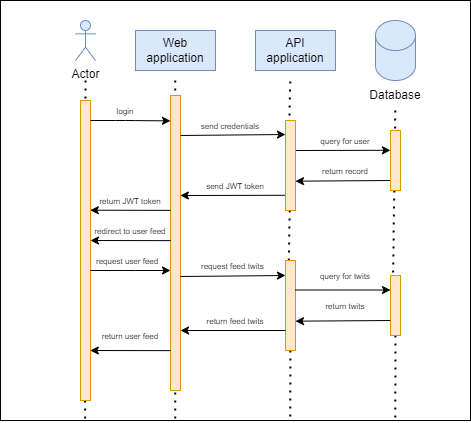

# Devops: Report for group F

Authors: \
Edward Rostomian - edwr@itu.dk \
Jerome Andersen Rahal - jrah@itu.dk \
Lukas Andersson - lukan@itu.dk \
Olvier Prip Hartmann - ohag@itu.dk

Course name: Devops, Software Evolution and Software Maintenance \
Class code: BSDSESM1KU

May 2025

# System perspective

## System design and architechture

Our ITU-minitwit system consists of a web application written in Typescript using the Remix framework, an API application written in C# using the .NET framework, a Postgres database, and Prometheus and Grafana for monitoring. The database is running inside a Docker container, on one dedicated virtual machine (VM) on Digital Ocean. The API application and the web application are running in a Docker Swarm, with 5 replicas of the API application and 2 replicas of the web application. Prometheus and Grafana each run in separate Docker containers. The 2 services in the Swarm, the container with Prometheus and the container with Grafana, are running on the same Docker network. The two VM’s are both running under the same firewall policy, managed by Digitalocean as a service.
This system architecture can be seen depicted in figure 1 shown below.

 \
*Figure 1: System architecture as a UML component diagram.*

The API application is structured with Clean architecture, that is, the onion skin architecture, which can be seen in figure 2 below. 

 \
*Figure 2: Clean architechture of API application.*

The “Controller” and “SimController” inside the API application in the outer layer are several controllers, each handling either follow relations, users, twits or authentication. The same principle goes for the “Service”, “SimService” and their respective interfaces. The services depend on the related entities and DTO’s inside the domain layer.

## Dependencies

The VM containing the Docker Swarm with web- and API-applications, Grafana and Prometheus are provisioned through Vagrant. The Vagrantfile for the VM depends on the vagrant-digitalocean plugin, to manage the digital ocean firewall through their API. The vagrantfile is also dependent on the Docker images being available from various Docker repositories, including ours on Docker Hub.

The VM’s are depending on having Docker installed. The VM’s are dependent on the correct environmental variables, for production, being available through a .env file. The VM containing the web application, API application, etc. are relying on a deployment script called deploy.sh. Both the .env file and deploy.sh file are uploaded through Vagrant, which means that the machine running the vagrantfile depends on having the deploy.sh.

The API application is dependent on having access to a database, through the given connection string. The web applications are dependent on the API application being reachable.

The API application is dependent on .NET 8, the Microsoft.Net.Sdk.Web containing ASP.NET Core, Microsoft.Entity.Framework, as well as a pair of related packages. 
We use EF Core for object relational-mapping of database interactions.
It depends on the Microsoft.AspNetCore.JWTBearer, as well as several other packages, for authentication purposes. To provide telemetry to Prometheus, we are using several packages like prometheus-net.AspNetCore.

The Web application uses the Remix framework building on React, together with Node.js and Express. We are using the crypto-js package to perform md5 hashing on the user email for generating an avatar.

## Subsystem interactions

 \
*Figure 3: nteraction between systems when a user logins via the website.*

As seen in figure 3 above.
When the actor, here being a user, signs into our website using the login page, the web application forwards the credentials to the API application, which checks for the user in the database. If such a user exists, a JWT token is sent from the API application to the user through the web application. The user is then redirected to the user feed, which makes the user (browser) request the user feed page. To provide that page, the web application needs the correct twits, which it requests from the API application. The API application queries the database for all relevant twits, and returns these twits to the web application, which returns the requested page to the user.

 \
*Figure 4: Interaction between systems when the simulator sends a request to the GetMessages endpoint.*

As seen in figure 4 above.
When the actor, here being the simulator, requests the twits of the public feed of the simulator API residing in the API application, it queries the latest 100 twits, unless another amount is specified by the actor. The returned twits are then forwarded back to the actor.

## Current state of the system

We describe the current state of the system using static code analysis with SonarQube and quality assessments (QA). 

 \
*Figure 5: Static analysis form SonarQube.*

The static analysis report generated by SonarQube is depicted in figure 5 above.

 \
*Figure 6: Issues found by SonarQube.*

We further breakdown some selected issues, as shown in figure 6, above, which included 2 bugs and 36 code smells (not conforming to best practice), mostly related to intentionality (17), consistency (12), and adaptability (9). Issues show different levels of severity that impact the software quality issues in maintainability (34), reliability (4) and security (0). We receive the grade A on security and maintainability, but the grade C for reliability, where the 4 issues related are trivial to fix.

# Process perspective

The process of an implemented issue from being raised as a pull request to merged into main and deployed to production, is depicted on figure 7 below.

 \
*Figure 7: Activity diagram of the development process, when issues are ready for review.*

CI/CD pipeline 
The CI/CD chains have been set up onGitHub Actions. We have 3 workflows: build_and_test.yaml, deploy.yaml and release.yaml.

 \
*Figure 8: Build and test workflow.*

The build and test workflow, shown in figure 8 above, triggers on pushes and pull requests to main, from other workflows or manually for testing purposes. It performs ShellCheck, KICS scanning of docker files, static analysis of the API- and web application, builds, and runs the automated test suite. 

 \
*Figure 9: Release workflow.*

The release workflow, shown on figure 9 above, triggers on version tag pushes or manually for testing purposes. First, it runs the build_and_test.yaml. Then, it builds and packages the API application for different operating systems. The web application is then built. All artifacts are versioned based on the latest git tag and published to GitHub Releases.

 \
*Figure 10: Deploy workflow.*

The deployment workflow, shown in figure 10 above, triggers on version tag pushes or manually for testing purposes, and runs the build_and_test.yaml at first. Then, it builds and pushes Docker Images for the API application and web application. It runs the images by starting them as containers. At last, it SSH’s into to our VM, and triggers rolling updates on the API application service and the web application service

Below is a diagram, figure 11, that depicts the process when a developer triggers a deployment to production, by tagging a commit to main and pushing it to GitHub. Step 2 and 3 are performed by the deploy workflow on GitHub, step 4 are performed by the Docker Swarm Manager node on the virtual machine.

 \
*Figure 11: Deploy artifacts to production process diagram.*

## Monitoring

Our monitoring consists of Prometheus and Grafana. Prometheus collecting and storing metrics, and Grafana visualizing the metrics. Grafana runs on port 3001, providing the dashboard depicted on figure 12 below:

 \
*Figure 12: Monitor dashboard*

The dashboard is a proof of concept, and has sparse information. Prometheus scrapes data from port 8080, which tracks
Active get requests
The application always handles one active request. As long as we have an active request, the system is up. 

HTTP request duration (for status code 200, 400, 404, 499)
This shows the duration of time for handling the request, for the described status codes. When a response is sent by the system, it shows a duration for the request. As long as we see a duration, the application is up.

Deductively, if there's always 1 active request, with a duration, our API must be healthy. This is how we use monitoring to check the status of our site, there are other attempts within the dashboard to monitor other metrics but these have been unsuccessful. 

Future work would consist primarily of switching from infrastructure-only monitoring to the inclusion of domain level monitoring. This would entail exposing new metric endpoints so that we could track information such as; 
Current active sessions
Successful logins 
Twits posted 
Follows/unfollows 
Adding these metrics would be the next natural addition for our monitoring. 

## Logging

Unfortunately, we did not manage to implement logging.

## Security

In the Security Assessment (see appendix A.1) we first did a Risk Identification of assets, threat sources and risk scenarios. Second, we performed a Risk Analysis of estimating likelihood and impact, resulting in a Risk Matrix to prioritize the risk scenarios. The analysis highlights several concerns, especially around XSS, DDoS, and leaked secrets. To address these, possible security hardenings can be implemented. 

These include:
- Implement and enforce HTTPS to prevent eavesdropping and man-in-the-middle attacks on user credentials
- Implement a encode method for all user input when rendering the frontend, or enforce strict headers like Content Security Policy (CSP) and X-XSS-Protection to prevent XSS
- Implement anti-CSRF tokens in forms and SameCite policies to prevent CSRF
Rate-limiting incoming requests per IP address at the API level and black-list malicious IP’s (although we know this isn’t feasible due to the simulator setup) 
- Implement authentication like two-factor authentication, or introduce CAPTCHA/reCAPTCHA to prevent bots on the webpage
- Running containers as non-root users and only exposing required ports safely, also no --privileged mode to prevent Misconfigured or Exposed Docker Services
- All secrets should be stored in environment variables and excluded from version control to prevent Leaked Secrets
- Stop using default credential and use role-based access control on Grafana and Prometheus dashboards to prevent unauthorized monitoring access.

What we hardened before doing the security assessment was: 
- Using EFCore (ORM) prepared statements instead of direct queries in the code when refactoring to prevent SQL injection attacks.
- We introduced JWT tokens for access restrictions on non-public features.
After the security assessment we did not implement anything due to time constraints, although we should have implemented TLS and swapped from HTTP to HTTPS along with the aforementioned security hardenings.

## Scaling and upgrades

At the start of the project, we found that the initial resources could not handle our tech stack, resulting in our database abruptly getting shut down by the system memory management. Therefore we scaled our application vertically by adding CPU power and memory.
Later, we added more storage capacity, as the number of users and posts increased.

At last, when the number of requests to the system increased, we scaled horizontally, migrating the web-, API- and monitoring applications to a separate VM. We also defined services in a Docker Swarm for the web and API application, running respectively 2 and 5 containers under one Docker manager node on one VM.
We applied rolling updates on these services, inside the Docker Swarm.

The next step we would consider for scaling, would be to scale horizontally, adding more Docker manager nodes across 3-5 VM’s, as well as adding more services to these nodes. This does not just increase the amount of load which the system can handle, but also makes it more redundant, not relying on just one VM.

Another step could be adding automatic rollback, based on some metric and/or healthcheck. Such features are provided by platforms like Kubernetes.

# Reflections perspective

## Evolution and refactoring

When refactoring the system we made too large a rewrite resulting in us falling behind on tasks. This, combined with the aforementioned data wipe, resulted in us constantly being behind and forcing us to sacrifice certain tasks such as logging. The large refactoring was not all negative. During our rewrite we switched to an ORM implementation and to PostgreSQL, which lessened the catch-up work later. 

## Operation

In general, we got to deal with errors within a few days, and in the last weeks of the course we did not see any errors at all. However, we did have a high count of errors. This was primarily because of the database being attacked and deleted in the first week of the simulator running (we forgot to change default credentials in time).

We redeployed part of our system from running on a single Docker container, to run on a Docker Swarm. This introduced some resilience patterns into our system, such that if one process dies, load is automatically diverted to other processes. This also meant that we could perform rolling updates, stop worrying about downtime, and update more frequently, as each update previously meant some downtime, creating an incentive to wait and pile updates.
It also increased load capacity for the system and by redeploying to a separate VM, freed up disc space for the database, which was just about to run out in the near future.

## Maintenance

We had an issue of high loading times because all twits were displayed on the same page. We tackled this by implementing pagination on feeds and userpages. We learned that only loading a part of the data, at a time is a good practice for efficiency when the system scales.
We made changes to our code, in order to increase maintainability, reported as issues by the SonarQube static code analysis. However, we are aware that software quality assessment tools are inconsistent. Furthermore, we implemented testing to ensure software quality, using the Arrange-Act-Assert pattern. We enhanced the manual tests with automated testing, integrating into CI chains. This had the advantages of reducing cost and human effort etc. However, we failed to automate the UI test suite due to issues with PlayWright.
Additionally, we maintained code quality through code reviews to decrease issues at a time cost. We scrambled together on problems and difficult tasks, to solve them faster and share knowledge, thus utilizing the principle “Swarm and solve problems to build new knowledge” under the principles of feedback. Finally, we added monitoring using Prometheus and Grafana, which helped us track the uptime of our system and observe when it goes down. However, without logging we cannot explain why a problem occurs; helping us in diagnosing, understanding, and recovering from a failure by collecting and analyzing data and errors generated by components of the system.

## Reflection on DevOps workstyle

When developing software we attempted to reflect upon and employ as many DevOps principles as possible. We made a rule on GitHub saying any PR from a feature branch into main, must be approved by 2 other members. Furthermore, we restricted team members from pushing directly to main, forcing this feedback based development. This conforms with the feedback principle of ‘working safely within complex systems’, as it allowed us to swarm around a problem in a PR, and share knowledge to all other team members. It also conforms with the principle ‘leaders create other leaders, who continually grow these types of capabilities’ as it is a way of sharing knowledge on a new feature of technology introduced.
We also maintained a constant up to date logbook as seen [here](https://github.com/minitwit-JOEL/minitwit-DEVOPS/blob/main/logbook.md) (https://github.com/minitwit-JOEL/minitwit-DEVOPS/blob/main/logbook.md). This was a way to apply the principle of ‘continuous learning’ as we used the logbook to solve previously encountered issues. Also, we had a docker compose file that was configured so that we could containerize the entire program, and everyone could run the program locally on their device. This supported the principle of ‘flow’, since we could work faster on tasks individually. Lastly, it reinforced the principle of ‘experimentation’, making it much simpler to experiment and take risks when everyone was able to run the program locally. 

## Ethics: Use of AI

We had a general consensus of not using ChatGPT or any other LLM to do the work for us, but we did use it for certain mundane or redundant tasks. In these exceptions where GPT was used, we co-authored the commit explicitly, such as [this](https://github.com/minitwit-JOEL/minitwit-DEVOPS/commit/4379e93709e9c95c7ed20e0342e01a4d3fa1bd48) (https://github.com/minitwit-JOEL/minitwit-DEVOPS/commit/4379e93709e9c95c7ed20e0342e01a4d3fa1bd48) example. Furthermore, we used AI for debugging certain parts of code or finding specific documentation. 

# Appendix

A.1: Security Assessment

1. Risk identification:
   
Assets:
- Web application frontend (minitwit-web)
- API backend (minitwit-api)
- PostgreSQL database	
- Authentication tokens and secrets
- Monitoring instances (Grafana, Prometheus)
- Docker

Threat sources:
- Cross-Site Scripting (XSS)
- Cross-Site Request Forgery (CSRF)
- Denial of Service (DoS)
- API abuse (unauthorized access)
- Misconfigured containers or exposed Docker services 
- Leaked secrets (JWT keys, database credentials)
- Sensitive user data, like passwords, are not encrypted over the internet, as we do not support og enforce HTTPS.

Risk scenarios:
- An attacker performs XSS to bypass access control, steal tokens or impersonate users.
- An attacker performs CSRF to trick authenticated users to perform unintended actions.
- An attacker performs DoS to bring the application down
- An attacker bypass rate limits or access unauthorized data.
- An attacker exploits containers or exposed Docker services to gain control.
- An attacker gets secrets in a scheme to forge tokens or access the database.
- An attacker accesses the monitoring tools to gather internal metrics or secrets.
- An attacker eavesdrops or perform a man-in-the-middle attack on the connection between the website or API and the user, and learns secret user credentials like passwords

2. Risk Analysis:
   
Likelihood:
- XSS are highly likely because we have several user input fields, e.g. login system and posting messages, across the applications frontend.
- CSRF attacks are medium likely when we do not have anti-CSRF tokens or some checking system with authentication is not properly implemented. 
- DoS attacks are highly likely without proper rate limiting or network protections.
- API abuse is medium likely because login is a barrier, but authentication is weak, and there is no enforcing on a rate-limitation from the user directly.
- Exploitation of misconfigured containers is less likely but possible with exposed ports or default settings like if images run as root. 
- Leaked secrets are less likely if secrets are stored in version control or misconfigured environment files.
- Unauthorized access to monitoring tools is less likely but possible if authentication is weak or URLs are exposed. 
- Eavesdropping or man-in-the-middle-attack on the connection between the user and the website or API is highly likely, as the whole chain of connection through the internet is the attack surface.

Impact:
- XSS attacks can lead to stolen credentials and full session hijacking, potentially compromising user accounts, hence a medium impact.
- CSRF attacks can cause misleading actions on behalf of authenticated users, such as posting messages, hence a medium impact.
- DoS attacks can bring down the application, a whole service disruption, hence a high impact.
- API abuse may result in unauthorized data access, data scraping, or backend overload, hence a medium impact.
- Misconfigured containers (breaches) can lead to root access, potentially compromising all services, hence a high impact.
- Leaked secrets can enable database or API access, but also access to less important systems, hence a medium impact.
- Unauthorized access to monitoring tools could leak internal metrics or system info to help further attacks, hence a low impact.
- The impact of a man-in-the-middle-attack or eavesdropping on the connection between the website or API and the user, has a high impact, as the attacker could learn user credentials or other secrets

